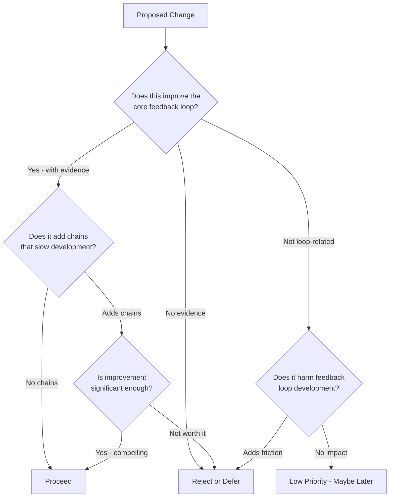

# Empirical Development Philosophy

## Core Principle

> **You cannot design your way to something you don't yet understand. You must learn your way there through rapid, measurable experiments.**

The Kahuna feedback loop - the mechanism by which VCK quality improves over time - is fundamentally unknowable in advance. We cannot design the optimal solution because we don't yet know what "optimal" looks like. We can only discover it through empirical testing, measurement, and iteration.

This is not a limitation to overcome; it is the nature of the problem. Embracing this reality is what separates Kahuna 2.0's approach from Kahuna 1.0's failure.

---

## Why Kahuna 1.0 Failed

Kahuna 1.0 had plenty of features but never achieved a working, functional product. The root causes:

1. **Feature creep from AI copilots**: Coding assistants constantly suggested "nice to have" improvements - optimizations, additional metrics, UI polish - that distracted from core functionality.

2. **Building on unvalidated foundations**: Features were stacked on top of each other before proving the base worked. When the foundation was flawed, everything built on it was wasted effort.

3. **Confusing activity for progress**: Dashboard metrics, sophisticated architecture, and polished UI created the illusion of advancement while the core value proposition remained unproven.

---

## The Empirical Mindset

### Every Change is a Hypothesis

When you modify feedback loop code, you are not "implementing a feature." You are running an experiment:

- **Hypothesis**: "This change will improve VCK quality as measured by [metric]"
- **Test**: Run the change through automated testing infrastructure
- **Result**: Measurable outcome that either validates or invalidates the hypothesis

Decisions flow from data, not intuition, preference, or "best practices."

### Simplicity is Required, Not Preferred

Complex systems obscure cause and effect. When a test fails or results degrade, you need to know _why_. Complexity makes this impossible.

Therefore:

- Choose the simplest solution that works
- Reject sophisticated designs until simplicity is proven insufficient
- Treat every abstraction as a cost, not a benefit

### Dependencies are Chains

Any code that depends on the feedback loop, or that the feedback loop depends on, creates coupling. Coupling slows iteration. Slow iteration prevents learning.

The only dependencies that should touch the feedback loop are those that **accelerate testing and measurement**. Everything else is a chain to be avoided or broken.

---

## What This Means in Practice

### Behaviors to AVOID

| Anti-pattern                                    | Why it's harmful                        |
| ----------------------------------------------- | --------------------------------------- |
| Adding features before proving core works       | Builds on unvalidated foundation        |
| "While I'm here, I'll also..."                  | Scope creep disguised as efficiency     |
| Sophisticated architecture upfront              | Complexity before understanding         |
| UI polish before functional validation          | Confuses looking good with working well |
| Metrics dashboards before metrics matter        | Measuring the wrong things              |
| "Best practice" without empirical justification | Cargo cult engineering                  |

### Behaviors to EMBRACE

| Practice                                        | Why it helps                              |
| ----------------------------------------------- | ----------------------------------------- |
| Ask "how will we measure this?" before building | Forces clarity on success criteria        |
| Implement the stupidest thing that could work   | Minimizes complexity, maximizes learning  |
| Run tests after every change                    | Fast feedback on hypothesis validity      |
| Delete code that isn't pulling its weight       | Reduces maintenance burden and complexity |
| Challenge "nice to have" suggestions            | Protects focus on core value              |
| Bring test results to team discussions          | Data-driven direction changes             |

---

## The Meta-Loop

There are two feedback loops in Kahuna:

1. **The Product Loop**: User context → VCK → Agent build → Results → Learning → Better VCKs
2. **The Development Loop**: Code change → Automated test → Results → Team analysis → Direction adjustment

The development loop is what enables us to discover the product loop. Without automated testing infrastructure that provides rapid, measurable feedback on code changes, we cannot learn our way to a working product.

**The testing infrastructure is the feedback loop for developing the feedback loop.** This is not an afterthought - it is as essential as the product itself.

---

## Decision Framework

When facing any development decision, work through these questions in order:

### The Three Questions

1. **Does this improve the core feedback loop?**
   - Must have measurable test results as evidence
   - "I think it will help" is not sufficient
   - If no clear measurement exists, define one first

2. **Does this speed up (or slow down) development of the feedback loop?**
   - Even good ideas can be rejected if they add chains
   - The only acceptable dependencies are those that accelerate testing
   - Ask: "Will this make the next iteration faster or slower?"

3. **At minimum, does this NOT harm feedback loop development?**
   - Features unrelated to the loop can exist if they're truly isolated
   - But they're low priority and should never block loop work
   - If there's any doubt about impact, defer it

---

## Success Criteria

This philosophy is working when:

- Team discussions reference test results, not opinions
- "Let's test that hypothesis" is a common response to ideas
- Code changes are small, frequent, and measurable
- Features are removed as readily as they're added
- The feedback loop can change without breaking unrelated systems

This philosophy is failing when:

- Features accumulate without validation
- "We'll test it later" becomes acceptable
- Complexity grows without corresponding capability
- Test results are ignored in favor of intuition
- The feedback loop becomes entangled with other systems
