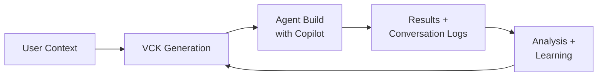
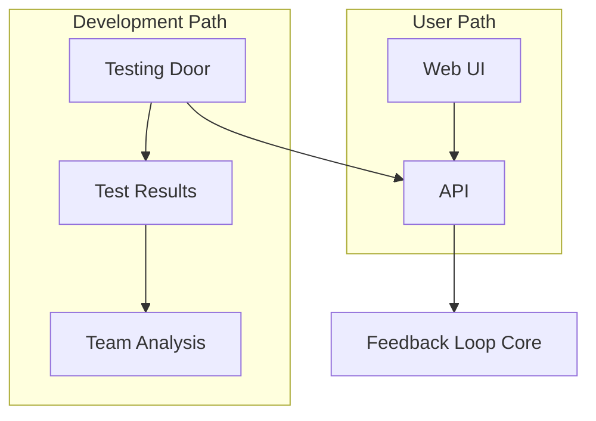

# Feedback Loop Strategy

This document describes the strategic approach to building Kahuna's core feedback loop. It complements [04_EMPIRICAL_DEVELOPMENT.md](./04_EMPIRICAL_DEVELOPMENT.md) which explains _why_ we approach development this way.

---

## What We're Building

### The Product: Vibe Code Kits (VCKs)

Kahuna's value proposition is simple: help non-technical users build AI agents by providing them with everything a coding copilot needs to succeed.

A **Vibe Code Kit (VCK)** is a downloadable folder containing:

| Component                 | Purpose                                                                     |
| ------------------------- | --------------------------------------------------------------------------- |
| **Copilot Configuration** | Rules, settings, tools, and preferences for the coding assistant            |
| **Business Context**      | Summary of user's business, goals, and requirements relevant to the project |
| **Framework Rules**       | Coding copilot rules for the specific agent framework (tested extensively)  |
| **Boilerplate Code**      | Starting point that copilots can build upon                                 |

### The Feedback Loop

The feedback loop is how VCKs improve over time:

1. User provides business context through the UI
2. Kahuna generates a VCK tailored to their needs
3. User's coding copilot builds an agent using the VCK
4. Conversation logs and resulting code are sent to Kahuna
5. Kahuna analyzes results and learns what works
6. Future VCKs incorporate these learnings

**The quality of VCKs is the ONLY metric that matters.** Everything else is secondary.

---

## The Four-Phase Strategy

We will build the feedback loop in four distinct phases. Each phase must be substantially complete before the next begins.

### Phase 1: Minimal Online

**Goal:** Get the feedback loop working in its simplest possible form.

This is not about elegance, optimization, or scalability. It's about having _something_ that:

- Takes user context as input
- Generates a VCK
- Can receive results back
- Records what happened

Design decisions in this phase default to "the simplest thing that could possibly work."

**Success criteria:** A complete loop that can be executed end-to-end, even if manually assisted.

### Phase 2: Insulate

**Goal:** Protect the feedback loop from external interference.

Once the loop exists, we must isolate it:

1. **Organize files**: Move all feedback loop code into clearly defined directories
2. **Document boundaries**: Explicitly document what is and isn't part of the loop
3. **Prevent coupling**: Establish rules that prevent other code from depending on loop internals
4. **Enable independent change**: The loop should be modifiable without touching unrelated systems

**Success criteria:** A developer can change feedback loop code without breaking anything else, and vice versa.

### Phase 3: Automate Testing

**Goal:** Enable rapid, programmatic validation of the feedback loop.

The UI is for users. But we need a separate path for development:

The **Testing Door** is a backend interface that:

- Triggers the feedback loop programmatically
- Uses predefined test contexts and scenarios
- Collects measurable results
- Runs quickly without UI interaction

This is not an afterthought—it should be designed alongside Phase 1. The testing infrastructure is part of the feedback loop, not separate from it.

**Success criteria:** A developer can run a test suite that exercises the feedback loop and produces measurable results in minutes, not hours.

### Phase 4: Refinement

**Goal:** Use empirical evidence to improve VCK quality iteratively.

With testing infrastructure in place:

1. **Run tests**: Execute test suites against current feedback loop
2. **Aggregate results**: Collect metrics that indicate VCK quality
3. **Analyze as a team**: Bring data to discussions, not opinions
4. **Make small changes**: Implement incremental improvements based on evidence
5. **Measure impact**: Verify changes actually improved outcomes
6. **Repeat**: Continue the cycle indefinitely

This phase never truly ends—it's the steady state of empirical development.

**Success criteria:** Team meetings reference test results when making direction decisions.

---

## Architecture Principles

These principles guide how we build and maintain the feedback loop:

### Isolation Over Integration

The feedback loop should be as self-contained as possible. External systems (auth, billing, admin UI) should interact with it through narrow, well-defined interfaces.

### Testing Door as First-Class Citizen

The programmatic testing interface is not a debugging tool—it's the instrument through which we learn. It should be:

- Fast (seconds per test, not minutes)
- Repeatable (same input → same output)
- Measurable (produces quantifiable results)
- Comprehensive (can exercise any path through the loop)

### Simplicity Until Proven Insufficient

When building or modifying the feedback loop:

- Start with the naive implementation
- Add complexity only when tests prove it's needed
- Remove complexity when tests pass without it

### Documentation as Memory

Context window limits mean AI copilots will forget. The feedback loop's design, boundaries, and decisions must be documented because:

- Future sessions need to understand what exists
- Team members need to understand why decisions were made
- The "why" is often more important than the "what"

---

## What This Means for Development

### Before Starting Any Work

Ask: "Does this relate to the feedback loop?"

- **If yes**: Follow empirical development practices (see 04_EMPIRICAL_DEVELOPMENT.md)
- **If no**: Ensure it won't interfere with loop development, then proceed

### When Proposing Changes

Frame proposals in terms of the four phases:

- "This helps get the loop online" (Phase 1)
- "This improves isolation" (Phase 2)
- "This makes testing faster/better" (Phase 3)
- "This is based on test results showing X" (Phase 4)

If a proposal doesn't fit any phase, question whether it should be done now.

### When Reviewing Code

Check that changes:

- Don't introduce dependencies on the feedback loop (unless for testing)
- Don't add complexity without evidence it's needed
- Include or update relevant tests
- Are documented if they affect loop boundaries
