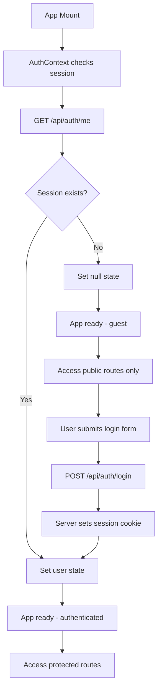
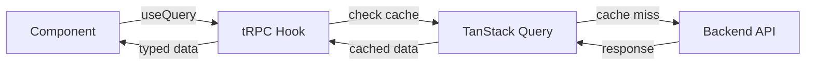
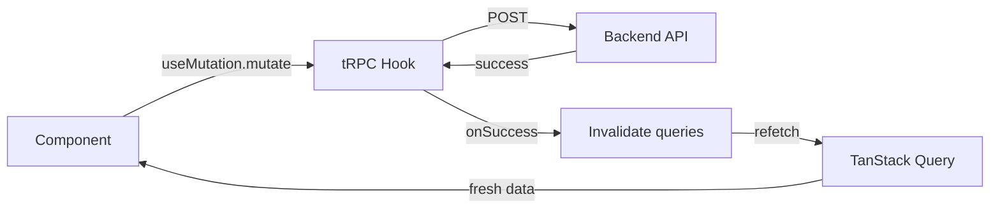

# Frontend Architecture

**Status:** Implemented (Phase 1: Minimal Online)
**Last Updated:** 2026-02-02

---

## Overview

Kahuna's frontend is a React single-page application built with Vite and TypeScript. It provides the user interface for creating projects, managing context files, generating VCKs, and uploading build results.

**Location:** `apps/web/`

**Technology Stack:**

| Technology      | Purpose                           |
| --------------- | --------------------------------- |
| React 18        | UI framework                      |
| Vite            | Build tool and dev server         |
| TypeScript      | Type safety                       |
| TanStack Query  | Server state management           |
| tRPC React      | Type-safe API communication       |
| React Router    | Client-side routing               |
| Tailwind CSS    | Styling                           |

---

## Architecture Decisions

### HashRouter for Routing

**Decision:** Use `HashRouter` instead of `BrowserRouter`.

**Rationale:** HashRouter uses URL fragments (`/#/path`) which don't require server configuration. This simplifies deployment—static files can be served from any web server without URL rewriting rules. The tradeoff (less clean URLs) is acceptable for an internal tool.

### tRPC + TanStack Query for Data Fetching

**Decision:** Use tRPC React hooks backed by TanStack Query for all feedback loop API calls.

**Rationale:**

- **Type safety** - Procedure inputs/outputs are inferred from the backend router
- **Caching** - TanStack Query provides automatic caching and cache invalidation
- **Mutations** - Built-in support for optimistic updates and invalidation patterns
- **DevTools** - TanStack Query DevTools for debugging (development only)

### Plain Fetch for Auth Endpoints

**Decision:** Use a plain fetch wrapper ([`auth-api.ts`](../../apps/web/src/lib/auth-api.ts)) for authentication endpoints instead of tRPC.

**Rationale:** Auth routes are Express routes (outside tRPC) because they need direct cookie manipulation. Using fetch keeps the auth layer simple and decoupled from the tRPC setup.

### React Context for Auth State Only

**Decision:** Use React Context for authentication state; no global state library.

**Rationale:** The only truly global state is "who is the current user?" Everything else (projects, context files, VCK data) is server state managed by TanStack Query. Adding Redux, Zustand, or similar would add complexity without benefit.

### Tailwind CSS for Styling

**Decision:** Use Tailwind CSS utility classes for styling.

**Rationale:** Utility-first CSS enables rapid iteration without context switching between files. Component styling is colocated with component logic. No CSS-in-JS runtime overhead.

---

## File Structure

```
apps/web/src/
├── main.tsx              # Entry point, provider setup
├── App.tsx               # Route definitions
├── vite-env.d.ts         # Vite type declarations
│
├── lib/                  # API clients and configuration
│   ├── config.ts         # Environment configuration
│   ├── trpc.ts           # tRPC React hooks setup
│   ├── trpc-client.ts    # tRPC client + QueryClient
│   └── auth-api.ts       # Auth API fetch wrapper
│
├── context/              # React contexts
│   └── AuthContext.tsx   # Authentication state
│
├── components/           # Shared components
│   ├── Layout.tsx        # App shell for authenticated pages
│   └── ProtectedRoute.tsx # Auth guard wrapper
│
├── pages/                # Page components
│   ├── LoginPage.tsx
│   ├── RegisterPage.tsx
│   ├── ProjectListPage.tsx
│   └── ProjectDetailPage.tsx
│
└── styles/
    └── global.css        # Tailwind entry point
```

### Key Files

| File                                                                       | Purpose                                          |
| -------------------------------------------------------------------------- | ------------------------------------------------ |
| [`main.tsx`](../../apps/web/src/main.tsx)                                  | Provider hierarchy, renders App into DOM         |
| [`App.tsx`](../../apps/web/src/App.tsx)                                    | Route definitions with protected/public split    |
| [`lib/trpc.ts`](../../apps/web/src/lib/trpc.ts)                            | Creates typed tRPC React hooks from AppRouter    |
| [`lib/trpc-client.ts`](../../apps/web/src/lib/trpc-client.ts)              | Configures tRPC client with cookie credentials   |
| [`lib/auth-api.ts`](../../apps/web/src/lib/auth-api.ts)                    | Fetch wrapper for `/api/auth/*` endpoints        |
| [`lib/config.ts`](../../apps/web/src/lib/config.ts)                        | Loads API URL from Vite environment              |
| [`context/AuthContext.tsx`](../../apps/web/src/context/AuthContext.tsx)    | Auth state provider with login/logout/register   |
| [`components/ProtectedRoute.tsx`](../../apps/web/src/components/ProtectedRoute.tsx) | Route guard that redirects unauthenticated users |
| [`components/Layout.tsx`](../../apps/web/src/components/Layout.tsx)        | App shell with header and logout button          |

---

## Provider Hierarchy

The application wraps components in a specific provider order:

```tsx
<StrictMode>
  <trpc.Provider>           // tRPC context
    <QueryClientProvider>   // TanStack Query
      <AuthProvider>        // Auth state
        <HashRouter>        // Routing
          <App />
        </HashRouter>
      </AuthProvider>
    </QueryClientProvider>
  </trpc.Provider>
</StrictMode>
```

**Why this order:**

1. **tRPC Provider** must wrap QueryClientProvider (tRPC uses React Query internally)
2. **QueryClientProvider** provides the cache for both tRPC and any direct React Query usage
3. **AuthProvider** can use tRPC/Query hooks if needed (currently uses fetch directly)
4. **HashRouter** provides routing context to App and all pages

---

## Routes

| Path             | Component           | Auth Required | Description            |
| ---------------- | ------------------- | ------------- | ---------------------- |
| `/login`         | LoginPage           | No            | Login form             |
| `/register`      | RegisterPage        | No            | Registration form      |
| `/`              | ProjectListPage     | Yes           | List user's projects   |
| `/projects/:id`  | ProjectDetailPage   | Yes           | Project detail/editing |

### Route Protection

Protected routes are wrapped with `ProtectedRoute`:

```tsx
<Routes>
  {/* Public routes */}
  <Route path="/login" element={<LoginPage />} />
  <Route path="/register" element={<RegisterPage />} />

  {/* Protected routes */}
  <Route element={<ProtectedRoute />}>
    <Route element={<Layout />}>
      <Route path="/" element={<ProjectListPage />} />
      <Route path="/projects/:id" element={<ProjectDetailPage />} />
    </Route>
  </Route>
</Routes>
```

`ProtectedRoute` behavior:

1. Shows loading spinner while checking auth state
2. Redirects to `/login` if not authenticated
3. Renders child routes via `<Outlet />` if authenticated

---

## API Integration

### tRPC Client Configuration

The tRPC client is configured with `credentials: 'include'` to send session cookies:

```typescript
// apps/web/src/lib/trpc-client.ts
const links = [
  httpBatchLink({
    url: `${config.apiUrl}/api/trpc`,
    fetch(url, options) {
      return fetch(url, {
        ...options,
        credentials: 'include', // Required for cookie auth
      });
    },
  }),
];
```

### Using tRPC Hooks

```tsx
// Query - fetch data
const { data, isLoading } = trpc.project.list.useQuery();

// Mutation with cache invalidation
const utils = trpc.useUtils();
const createProject = trpc.project.create.useMutation({
  onSuccess: () => {
    utils.project.list.invalidate(); // Refresh project list
  },
});
```

### Auth API Client

Auth endpoints use a plain fetch wrapper since they're outside tRPC:

```typescript
// apps/web/src/lib/auth-api.ts
export const authApi = {
  login(email, password)    // POST /api/auth/login
  register(email, password) // POST /api/auth/register
  logout()                  // POST /api/auth/logout
  me()                      // GET /api/auth/me
};
```

All auth requests include `credentials: 'include'` for cookie handling.

### VCK Download

VCK downloads use a direct Express endpoint (not tRPC) to return a file:

```
GET /api/vck/:projectId/download
```

This returns a ZIP file containing the generated VCK.

---

## Authentication Flow



### Session Persistence

1. On login/register, the backend sets an HttpOnly cookie (`kahuna.sid`)
2. On page refresh, AuthContext calls `/api/auth/me` to restore the session
3. The cookie is automatically included in all requests (`credentials: 'include'`)
4. On logout, the backend clears the cookie

---

## Data Flow

### Query Data Flow



### Mutation Data Flow



### Query Client Defaults

```typescript
const queryClient = new QueryClient({
  defaultOptions: {
    queries: {
      refetchOnWindowFocus: false, // Don't refetch on tab focus
      retry: 1,                    // Retry failed queries once
      staleTime: 30 * 1000,        // Data fresh for 30 seconds
    },
  },
});
```

---

## Environment Configuration

The frontend uses Vite's environment variable system:

```typescript
// apps/web/src/lib/config.ts
export const config = {
  apiUrl: import.meta.env.VITE_API_URL || 'http://localhost:3000',
};
```

**Required environment variable:**

| Variable       | Default                 | Purpose                |
| -------------- | ----------------------- | ---------------------- |
| `VITE_API_URL` | `http://localhost:3000` | Backend API base URL   |

In development, the Vite dev server proxies API requests to the backend.

---

## Development Workflow

### Running the Frontend

```bash
# From repository root
pnpm dev:web          # Start Vite dev server on :5173

# Or with full stack
pnpm dev              # Start both web and api
```

### Type Safety

The frontend imports types directly from the API package:

```typescript
// apps/web/src/lib/trpc.ts
import type { AppRouter } from '../../../api/src/trpc/router.js';
```

This path import (rather than package import) provides:

- Full type inference for all tRPC procedures
- IDE autocompletion for procedure names and inputs
- Compile-time errors if API contract changes

---

## Phase 1 Scope

| Include                  | Exclude                  |
| ------------------------ | ------------------------ |
| Login/register pages     | Password reset           |
| Project list view        | Project search/filter    |
| Project detail view      | Real-time updates        |
| Context file management  | Drag-and-drop upload     |
| VCK download             | VCK preview              |
| Build results upload     | Results visualization    |
| Basic error handling     | Toast notifications      |
| Loading states           | Skeleton loaders         |

---

## Related Documentation

- [Repository Infrastructure](./01-repository-infrastructure.md) - Monorepo setup, TypeScript config
- [Foundational Infrastructure](./03-foundational-infrastructure.md) - Backend auth, tRPC setup
- [Feedback Loop Architecture](./02-feedback-loop-architecture.md) - Data entities and API endpoints
- [System Boundaries](./04-system-boundaries.md) - Domain separation
