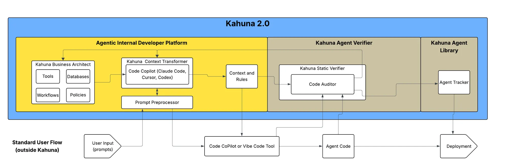

# Kahuna Rebuild Implementation Plan

## Goal

The end goal is to release Kahuna Rebuild ASAP with the following feature set:

- Business Architect collects business information using manual and automated methods.
- Context Translator uses business information, user prompts, and intelligence to generate prompts for vibe code tools.
- Static Verifier reviews the output of the vibe code tool (agent code, session, traces) and identifies errors and warnings.
- Agent Library collects and registers agents throughout the organization, displays verification status, and provides an environment for distribution.

## Stages

Implementation will occur in 2 stages: first delivering a standard version of Kahuna, then a professional/enterprise version later based on feedback from the standard version.

- Standard version will contain manual collection of business information, basic context translator for most popular tools, static verifier to verify against business information, and agent library to manually register agents and display static verification results.
  - Standard will be designed for individual users.

## Stage 1 - Kahuna Standard

The goal for the Standard version of Kahuna is to get a product out ASAP that provides the functionality of adding business context to vibe code tools. This release will show the value of this context in creating better agents in less time and demonstrate the potential for enterprise leaders to address security, policy, and cost issues of using vibe code tools with Kahuna.

### Step 1 - Build a context translator testing environment

The main value of the standard release is demonstrating how Kahuna can add context to vibe code tools to make them produce better agents. To do this, we need to refine the context translator to output the best prompts, rules, and config files possible based on the business information collected. The feedback loop—from capturing business information, to creating vibe code prompts, rules, and configs, to analyzing the output from the vibe code tool, and feeding back results so the translator can be improved—will produce better and better agents. This feedback system will be the heart of Kahuna and is the first area of focus.

1. Add ability to manually input policy/rules into Business Architect.
2. Add ability to output prompt, rules files, tools files, and config information for vibe code tools: Claude Code, Cursor, Codex.
3. Create ability to collect output code and tool information (session messages, traces) from vibe code tools (before agent is run).
4. Create ability to scan the vibe code output and identify if the vibe code tool improved with context.
   1. Will require inputting output of vibe code tool without Kahuna context.
5. Create report that Kahuna developers use to improve data collection and context translator.

Using this environment, we will have multiple testers create different agents and push them through to refine the output.

### Step 2 - Update UX experience for standard version

We will keep the same UI look and feel as Kahuna 1.0 but will update UX to fit the new workflow.

1. Architect mode - Keep tool and database capture, keep create workflows, add policy capture, add prompt download, add user prompt input in place of workflows on main dashboard.
2. Developer Mode - Becomes verifier; dashboard should facilitate capturing output of vibe code tool for an agent (and store), with a button to run verification of the output to generate a report. Should show path to Dynamic Verifier (under construction).

### Step 3 - Testing, improvement, release

## Feature Requirements Summary

Based on the sprint breakdown planning, the following features will be built in the new repository:

### Business Architect Features

- Tool and database capture (carried over from Kahuna 1.0)
- Workflow creation capabilities
- Policy/rules input method
- Business information download/upload
- Authorization and connectivity checks for business information elements
- User prompt input with context parsing from business information

### Context Translator Features

- Framework to transform business information into context for vibe code tools
- Support for multiple output targets:
  - Claude Code
  - Cursor
  - Codex
  - Crew
  - LangChain/LangGraph
  - Code-first SDK
- Path for direct specification input to copilot

### Static Verifier Features

- Capture and storage of vibe code tool output
- Verification engine to check output against business rules
- Intelligence layer for rule verification (LLM as judge approach)
- Report generation for verification results

### Agent Library Features

- Display agents captured from verifier with verification status
- Upload capability for agents not built/verified in Kahuna
- Download/distribution capability for agents (potential GitHub integration)

### User Experience

- Individual user focus (no team/role onboarding)
- Multiple projects per user
- Streamlined modes: Architect and Verifier (formerly Developer Mode)
- Clear path indication to future Dynamic Verifier capability
